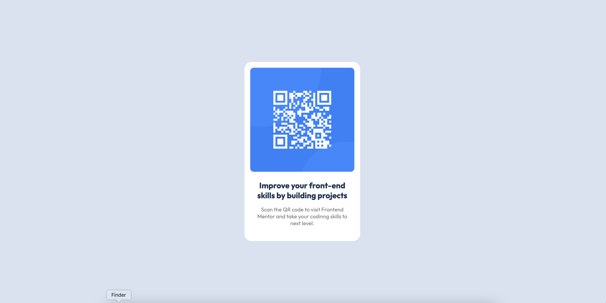

# Frontend Mentor - QR code component solution

This is a solution to the [QR code component challenge on Frontend Mentor](https://www.frontendmentor.io/challenges/qr-code-component-iux_sIO_H). Frontend Mentor challenges help you improve your coding skills by building realistic projects. 

## Table of contents

- [Screenshot](line 15)
- [Links](line 20)
- [Built with](line 25)
- [What I learned](line 34)
- [Useful resources](line 40)
- [Author](line 45)

### Screenshot

### Links

- Live Site URL: [Add live site URL here](https://ryichi0.github.io/qr-code/)

### Built with

- Semantic HTML5 markup
- CSS custom properties
- Flexbox
- CSS Grid
- Media query

### What I learned

my biggest challenge was to add font-family to my project. first i tried @font-face in css file, but it wasn't working so i google the stuff and ran into another solution. it was link tag which i used in my html page. but something was not working properly so i checked if this font is still on web or not, i was and i used the link which google font presented. eventually i solved my problem. but i am pretty sure i could've done it in fewer lines of code.
DO YOU HAVE GOT ANY IDEA HOW?

### Useful resources

- [addinng google font usign link tag](https://www.w3schools.com/css/css_font_google.asp) - This helped me have a proper pattern for adding a google font to project.

## Author

- Github - [Ghazal Mahmoodi](https://github.com/ryichi0)
- Email - (ghazalmahmoodi23@gmail.com)

